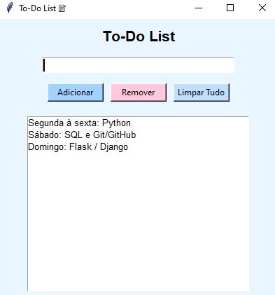

# 📝 To-Do List em Python (Tkinter)

Um simples **gerenciador de tarefas (To-Do List)** desenvolvido em **Python**, utilizando a biblioteca **Tkinter** para a interface gráfica.  
O aplicativo permite adicionar, remover e limpar tarefas de forma prática e visual, ideal para quem está aprendendo sobre GUIs em Python.

---
## Confira a interface gráfica

<p style="text-align:center;">
  
</p>

---

## 🚀 Funcionalidades

- ✅ **Adicionar tarefas** à lista.  
- ❌ **Remover tarefas** selecionadas.  
- 🧹 **Limpar todas as tarefas** com um clique.  
- 💡 Interface simples, intuitiva e colorida.  

---

## 🧠 Tecnologias Utilizadas

- **Python**
- **Tkinter** (biblioteca padrão para GUIs em Python)

---

## 📦 Como Executar o Projeto

1. **Clone o repositório:**
   ```bash
   git clone https://github.com/theuspedrosa/ToDoList-Tkinter.git
2. **Acesse a pasta do projeto:**
   ```bash
   cd ToDoList-Tkinter
3. **Execute o script principal:**
   ```bash
   python todo_list.py
   python3 todo_list.py (Em alguns sistemas, como macOS ou Linux, pode ser necessário usar este)

# 💡 Certifique-se de ter o Python instalado em seu computador.
Você pode baixar em: https://www.python.org/downloads/

## 👨‍💻 Autor

Matheus Pedrosa de Lima - [LinkedIn](https://linkedin.com/in/matheus-pedrosa-54b591289)

---

## 📄 Licença

Este projeto está licenciado sob a licença MIT.
É de uso livre para fins educacionais.
Sinta-se à vontade para clonar, editar e aprimorar, caso queira.
